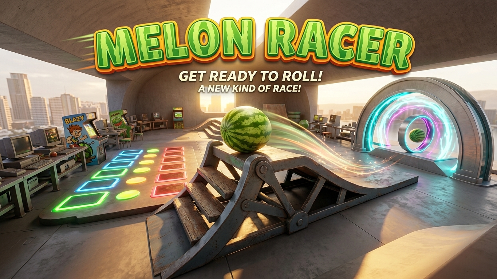

# Melon Racer



> **Work in progress.** This mode is still under active development and known to have bugs (see [Known limitations / open questions](#known-limitations--open-questions) below). Contributions, bug reports, and further development are very welcome — see [Extending the mode](#extending-the-mode) and [Contributing](#contributing).

**Melon Racer** is a custom kart-racing game mode built as a [Counter-Strike 2](https://www.counter-strike.net/cs2) Workshop Tools addon. Instead of shooting each other, players push/ride a `prop_physics` melon around one or more tracks laid out inside a single map, with lap counting, checkpoints, a shared hub area, and a simple race-heat flow (countdown → race → break → next track).

There is no combat: weapons are stripped, fall/weapon damage is disabled, and the only "damage" system in the mode is the melon's own health pool, which is worn down by hard impacts (crashes, rough landings) rather than gunfire.

This document is the entry point for anyone who wants to **run, understand, or extend** this addon. It links out to three more detailed documents that already live in this repo — read this file first, then follow the links for the part you need.

| Document | Covers |
|---|---|
| [README.md](README.md) (this file) | Overview, setup, project structure, how everything fits together |
| [AGENTS.md](AGENTS.md) | The CS2 `cs_script` engine API, the build pipeline, and hard editing rules for this addon |
| [GAMEPLAY.md](GAMEPLAY.md) | Game design: concept, race-heat flow, checkpoint/lap logic, moderator powers, melon health, open design questions |
| [TRACK_CREATION.md](TRACK_CREATION.md) | Step-by-step Hammer guide for adding a new track — no script changes required |
| [MAPPING_API.md](MAPPING_API.md) | Mapping reference: every entity name, name pattern and script input the map can use, plus the conventions they follow |

## How the game mode works

- **Movement**: each player automatically gets their own melon prop. The player's own pawn is frozen, hidden, and parked out of the way — you never see or control it directly. Steering follows the camera (mouse look): `W`/`S` accelerate/brake along the look direction, `A`/`D` strafe, `Space` jumps. A third-person chase camera follows the melon; camera zones in the map zoom it in or out.
- **Melon health**: hard impacts (crashing into geometry, rough landings) damage the melon based on the sudden change in velocity. At zero health the melon "breaks" and respawns at the last checkpoint after a short delay.
- **Checkpoints & laps**: a track is a sequence of checkpoint triggers plus a finish line. Progress only ever moves forward, and a lap only counts once the last checkpoint has been reached since the previous lap. Reaching the configured lap count finishes that racer's heat.
- **Hub → race → next track**: the map is one continuous space. Players gather in a hub area; anyone standing there can start a heat, which pulls in everyone currently in the hub trigger, counts down, and races the next track in sequence. After a track's heat ends, there's a short break before the next track starts, or everyone returns to the hub after the last one.
- **Moderator**: the first connected player can abort a running heat. The role passes to the next-oldest connected player if they disconnect.
- **Melon painting**: driving over a paint trigger (or picking a color from the in-game menu) recolors your melon.

For the full design rationale and exact mechanics (impact-damage tuning, track-config parsing, race-phase state machine, etc.), see [GAMEPLAY.md](GAMEPLAY.md).

## Requirements

- **Counter-Strike 2** with the **Workshop Tools** installed (via Steam → CS2 → Properties → Betas / Tools, or the CS2 Workshop Tools depot).
- **Node.js** (any reasonably recent LTS) — only needed to run the build step for the gameplay scripts.
- This addon lives inside your CS2 installation at:
  `.../Counter-Strike Global Offensive/content/csgo_addons/melon_racer`
  (Workshop Tools addons are expected to live under `content/csgo_addons/<addon_name>`, not in an arbitrary location.)

## Getting started

1. Install dependencies and build the gameplay scripts:

   ```
   npm install
   npm run build
   ```

   This compiles the hand-authored source under `src/` into the flat bundles under `maps/scripts/` that the map actually loads (see [Architecture](#architecture) below). Use `npm run watch` instead while iterating — it rebuilds on every save.

2. Launch CS2 in tools mode and open `maps/melon_racer.vmap` in **Hammer** (Assets → open the addon), or load the map directly in-game with `map melon_racer` (requires `sv_cheats 1`, which the mode's `gamemode` script already sets).

3. Play. To try a script change, edit a file under `src/`, run `npm run build` (or leave `npm run watch` running), and save/reload in tools mode — CS2 hot-reloads `point_script` entities on file save.

There is no automated test suite or CLI compiler for this addon (Workshop Tools content isn't set up for that) — the only way to verify a change is to load the map and play it. See [AGENTS.md](AGENTS.md) for details on tools-mode hot reload and its quirks (e.g. module-level state surviving a reload).

## Project structure

```
melon_racer/
├── AGENTS.md, GAMEPLAY.md, TRACK_CREATION.md,  # detailed docs, see table above
│   MAPPING_API.md
├── build.mjs, package.json                     # Rollup build: src/ -> maps/scripts/
├── cfg/melon_racer.cfg                         # server cvars for this map
├── maps/
│   ├── melon_racer.vmap                        # the map (Hammer-authoritative, binary)
│   ├── cfg/melon_racer.cfg                     # same cvars, map-local copy
│   └── scripts/
│       ├── melon_drive.js                      # AUTO-GENERATED — do not edit directly
│       ├── gamemode.js                         # AUTO-GENERATED — do not edit directly
│       └── point_script.d.ts                   # cs_script API type declarations (for editor tooling)
├── panorama/
│   ├── layout/custom_game/speedometer.xml      # HUD layout (speedometer, HUD, menus)
│   └── styles/custom_game/speedometer.css      # HUD styling
├── postprocess/melon_racer.vpost               # post-processing volume (bloom/tonemapping)
├── soundevents/soundevents_addon.vsndevts      # sound event definitions
├── sounds/*.wav                                # ambience source audio
└── src/                                        # hand-authored gameplay scripts (edit here)
    ├── tsconfig.json                           # editor type-checking config
    ├── gamemode/index.js                       # cvars, teams, disables combat damage
    └── melon_drive/                            # the core game mode, one folder per domain:
        ├── index.js          # wiring only: tick loop, hot-reload snapshot, each domain's Register*Inputs()
        ├── constants/index.js # re-exports every folder's constants.js (tunables + Hammer names)
        ├── core/             # kart registry, per-tick driver (think.js), traces, Debug
        ├── kart/             # spawning melons + parking pawns, spawn points, teleporting, paint + glow
        ├── movement/         # driving, floor/wall contact, jumping, wall bounce, attack boost, momentum
        ├── health/           # impact damage, breaking + respawn, healing
        ├── zones/            # lift, jump pad, camera zone and teleporter triggers
        ├── race/             # tracks from trigger names, checkpoints/laps, time trial, hub/heat flow
        ├── camera/           # third-person chase camera and its zooms
        ├── hud/              # one file per HUD panel (speedometer, bounce panel, track, hub modal, user menu), button clicks
        ├── fx/               # particles, boost trail, guide line
        └── dev/              # debug views (collision debug, attack log)
```

There is no `addoninfo.txt` — CS2 Workshop Tools identifies this addon purely by its folder name (`melon_racer`) under `csgo_addons/`.

## Architecture

Everything gameplay-related runs as **`cs_script`** — plain JavaScript on `point_script` entities placed in the map (not VScript/Squirrel, and not the Pulse graph system). There are two `point_script` entities:

- `gamemode` (built from `src/gamemode/`) — sets server cvars, forces everyone onto one team, strips weapons, and disables weapon/fall damage. Small and mostly static.
- `melon_drive` (built from `src/melon_drive/`) — everything else: physics, race flow, checkpoints, camera, HUD.

The pieces connect like this:

```
Hammer entities (triggers, point_templates, named by convention)
        │  OnStartTouch → RunScriptInput → <name>
        ▼
maps/scripts/melon_drive.js   (AUTO-GENERATED bundle, this is what Hammer loads)
        │  Rollup-bundled 1:1 from
        ▼
src/melon_drive/**/*.js        (source of truth — edit these)
        │  drives
        ▼
panorama/.../speedometer.xml + .css   (custom_hud_layout — speedometer, menus, banners)
```

- **Hammer → script**: trigger volumes fire `RunScriptInput` with a specific parameter string. Track layout itself is config-free — a track's lap count and spawn point are parsed straight out of its start trigger's *name* (`start_<id>_laps<M>`) and transform, its checkpoint count from how many `checkpoint_<id>_<index>` triggers it has, and the finish line is its own input (`finish_<id>`) so a track doesn't have to be a loop. See [TRACK_CREATION.md](TRACK_CREATION.md) for the exact entity/output wiring and [MAPPING_API.md](MAPPING_API.md) for the complete list of names and inputs.
- **Build step**: Hammer's own JS compiler doesn't resolve local `import`s, so `build.mjs` (Rollup) flattens each `src/<entry>/` tree into the single file its `point_script` entity actually points at. **Always edit under `src/`, never the generated files in `maps/scripts/`** — they're overwritten on the next build and carry an `AUTO-GENERATED` banner.
- **Script → HUD**: the custom HUD (`speed_hud` entity) is driven entirely from script via `SetDialogVariableStringForPlayer`, `SetHasClassForPlayer`, and click callbacks — the XML/CSS only define static layout and styling, with no logic of their own.

For the full `cs_script` API reference (available `Instance` calls, entity classes, the custom-HUD mechanism, hot-reload behavior) see [AGENTS.md](AGENTS.md).

## Extending the mode

Some common ways to build on this repo, and where to start:

- **Add a new track** — pure Hammer work, no script changes. Follow [TRACK_CREATION.md](TRACK_CREATION.md) step by step.
- **Tune physics/feel** (acceleration, top speed, jump height, impact-damage sensitivity, camera offsets, timings) — every tunable lives in the `constants.js` of the folder it belongs to (`movement/driving/`, `movement/jump/`, `camera/`, …), all re-exported by `src/melon_drive/constants/index.js`. Change a value, rebuild, and hot-reload in tools mode to feel the difference immediately.
- **Add HUD elements or menus** — edit `panorama/layout/custom_game/speedometer.xml` and the matching `speedometer.css`, then wire the new elements from `src/melon_drive/hud/`. Note CS2's custom HUD layouts only support `<Panel>`, `<Label>`, `<Image>`, and `<Button>` — no native sliders/inputs and no inline scripting.
- **Add gameplay mechanics** (boost pads, new trigger types, new melon behaviors) — follow the existing pattern: a Hammer trigger fires `RunScriptInput` on `melon_drive`, handled by a new feature folder (or an extended one) under the fitting domain in `src/melon_drive/` — `constants.js`, pure rules in `logic.js`, engine side, `inputs.js` for its script inputs — registered through that domain's `Register*Inputs()`.
- **Add sound** — `soundevents/soundevents_addon.vsndevts` currently only contains Valve's stock example ambience events; there's no melon-specific audio yet (e.g. a break sound, engine/roll sound, countdown beep) — a good, self-contained first contribution.

When in doubt about an engine API call or addon-editing rule, check [AGENTS.md](AGENTS.md) first — it also points at a local reference addon (`cs_script_demo`) with minimal worked examples for common `cs_script` patterns.

## Known limitations / open questions

These are tracked in more detail in [GAMEPLAY.md](GAMEPLAY.md)'s "Open design questions" section, but worth knowing up front:

- No handling yet for a straggler who falls far behind or gets stuck mid-heat — the group waits until every racer finishes or disconnects.
- No winner/placement display (1st/2nd/3rd) — currently only whether a heat is finished, not who finished it first.
- No melon-specific sound effects yet (see above).

## Contributing

- Keep gameplay-design decisions and rationale in [GAMEPLAY.md](GAMEPLAY.md), engine/build/editing rules in [AGENTS.md](AGENTS.md), and track-authoring steps in [TRACK_CREATION.md](TRACK_CREATION.md) — update the relevant doc alongside any change that affects it.
- `maps/*.vmap`, `postprocess/*.vpost`, and `soundevents/*.vsndevts` are Hammer-authoritative; make those changes in Hammer itself rather than hand-editing the files.
- Always edit `src/<entry>/*.js`, run `npm run build` (or keep `npm run watch` running), and verify by playing the map — there is no other way to confirm a gameplay change works.
- There's no CI or automated tests here, so a PR description should note how the change was manually verified (e.g. "tested in-game with `DEBUG = true`, checkpoint 1_2 confirmed advancing progress").
